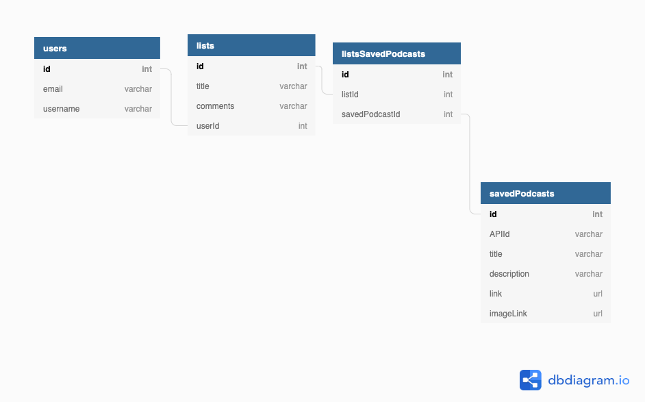

# Podist

An app for searching and organizing podcasts into list formats so that users can
more easily recommend podcasts to their friends.
 
***

## How to initialize this app

1. Install json-server
    ```shell session
    $ npm install -g json-server
    ```

2. Install package.json
    ```shell session
    $ npm install pkg.json
    ```

3. Clone the Github repository to your local machine.
    ```shell session
    $ git clone git@github.com:MurdockDM/Podist.git
    ```   

4. In the root directory there should be a folder labeled api
    ```shell session
    $ cd api
    $ touch database.json
    ```

5. The database structure will need to be created as follows in a JSON format in
   the database.json file:


6. Next install Material UI in order to view the styling for the app
    ```shell session
    $ npm install @material-ui/core
    ```

7. An API key must be obtained from the [ListenNotes
   API](https://www.listennotes.com/api/). This key must then be put into a
   specific file.
   ```shell session
   $ cd src/components/modules
   $ touch ExternalAPIKey.js
   ```
   Place the following inside the ExternalAPIKey.js file
   ```shell session
   export default {
   myAPIKeyTitle: "X-ListenAPI-Key",
   myAPIKey: "Put your api key here"
} 

8. Open a tab in terminal and change to the api directory then start the
   json-server there
   ```shell session
   $ json-server -p 8088 -w database.json
   ```

9. Then in a separate tab in the terminal initialize the app 
    ```shell session
    $ npm start
    ```

10. The application will require a login using email and a user name. This can be
   created on the Sign Up page found on the navbar.


This project was bootstrapped with [Create React App](https://github.com/facebook/create-react-app).

